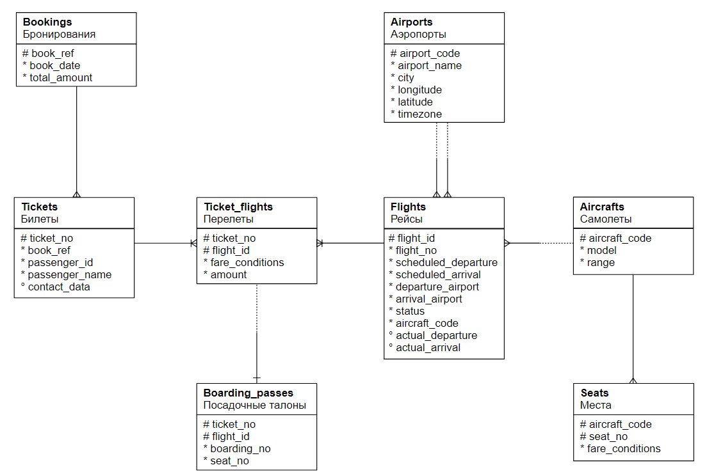

# FOR OTUS MENTOR:
## How to
1. [Run postgres (and all that is needed)](docs/infrastructure.md). 

login: ```admin@admin.ru```
password: ```password``` (for all resources) 

2. Check homeworks:

   * [DML 9](hw/dml_9.sql) (DML: вставка, обновление, удаление, выборка данных)
   * [Indexes 11](hw/indexes_11.sql)
   * [DML 12](hw/dml_12.sql) (DML: агрегация и сортировка, CTE, аналитические функции )

  

3. I'm using sample db:
   
  

4. Using [madlib](hw/madlib_scripts.sql):

/usr/local/madlib/bin/madpack -s madlib -p postgres install

psql -U admin -d dev_kit_db -c "grant usage on schema madlib to dev_kit_user;"